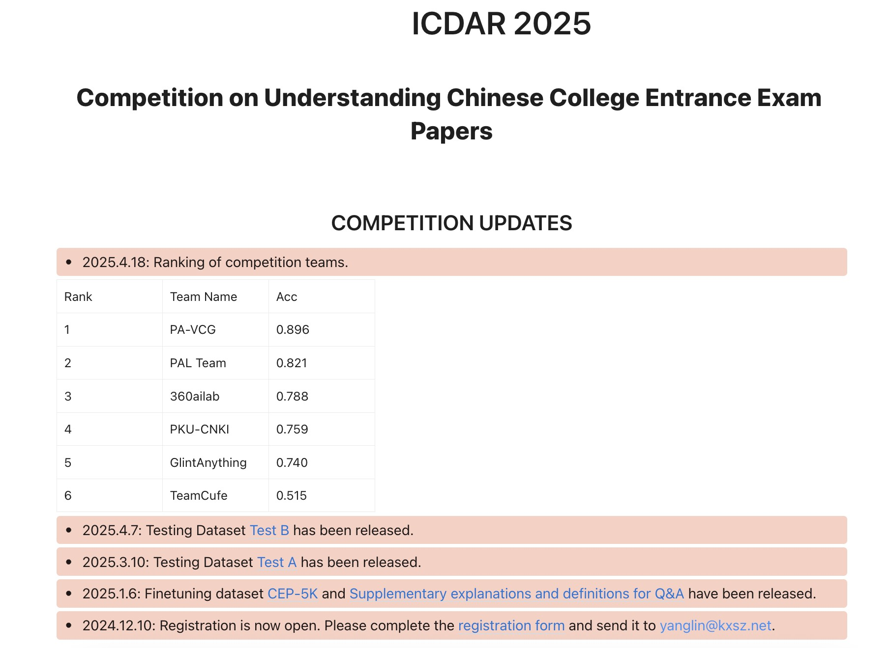

<p align="center">
  <h2 align="center" style="margin-top: -30px;">Team PA-VCG’s Solution for Competition on
Understanding Chinese College Entrance Exam
Papers in ICDAR’25</h2>
</p>

<div style="font-family: charter;" align="center">
    <a href="https://github.com/Dejavuvvw" target="_blank">Wei Wu</a>,
    <a href="https://www.zhihu.com/people/wenjtop" target="_blank">Wenjie Wang</a>,
    <a href="tanyang1231@163.com" target="_blank">Yang Tan</a>,
    <a href="liuying234@163.com" target="_blank">Ying Liu</a>,
    <a href="diaoliang91@gmail.com" target="_blank">Liang Diao</a>
</div>

<br>
<p align="center">
  
</p>

[]()
[](https://note.kxsz.net/share/b0d4b929-232d-460d-9107-374a15d6767f)
[]()

## 📰 News 
- [2025-06-06] We release our code.
- [2025-04-18] We win the competition.

## 📦 To be released
- HuggingFace link for our model and data.
- arXiv paper for our solution.

## 📋 Overview

This repository contains the official implementation of our winning solution for the ICDAR 2025 competition on “Understanding Chinese College Entrance Exam Papers”.

## 🔥 Highlights

- 🔍 We use high resolution and multiple images MLLM for dense OCR predition.
- 📸 We use OCR distillation data and full-parameter finetune.
- 💪 We use some prompt refinement and post processing methods.

### Prepare OCR distillation data and prompt refinement
We use [OVIS-4B](https://huggingface.co/AIDC-AI/Ovis2-4B) to generate OCR data. For exam papers with double-columns, we first split them into single-column format before extracting OCR data.

## 🛠️ Installation

### Setup Environment
We use [ms-swift-3.2.0](https://github.com/modelscope/ms-swift/tree/v3.2.0) to train our models. You can setup environment follow [link](https://github.com/modelscope/ms-swift/tree/v3.2.0?tab=readme-ov-file#%EF%B8%8F-installation).

### Train with OCR
Use our [swift](./swift) to replace `ms-swift/swift`.

```bash
NODE_RANK=0
MASTER_ADDR="0.0.0.0"
MASTER_PORT=8999
SWIFT_CLI="xxx/python3.10/site-packages/swift/cli"

which torchrun
torchrun \
    --nproc_per_node 8 \
    --nnodes="${NNODES}" \
    --node_rank="${NODE_RANK}" \
    --master_addr="${MASTER_ADDR}" \
    --master_port="${MASTER_PORT}" \
    $xxx


```

2. run inference.sh. One A800-80G is enough to run.

```bash
cd /app
bash inference.sh
```

you should change the model dir

```bash
# 80G
MODEL='YOUR MODEL'
VAL_DATA='/app/TestA_promptNew.jsonl'
CUDA_VISIBLE_DEVICES=0 \
MAX_PIXELS=802816 \
swift infer \
    --model $MODEL \
    --infer_backend pt \
    --stream false \
    --temperature 0.01 \
    --top_k 1 \
    --top_p 0.001 \
    --max_new_tokens 50000 \
    --val_dataset $VAL_DATA \
    --remove_unused_columns false \
    --attn_impl flash_attn \
    --max_batch_size 1
```

3. the output is saved in your model dir

```python
python convert2final_json.py <your_pred_save_path> <save_json_name>
```

## 📚 Citation

If you find our paper and code useful for your research and applications, please cite using this BibTeX:

## 📄 License

This project is licensed under the MIT License - see the LICENSE file for details.
